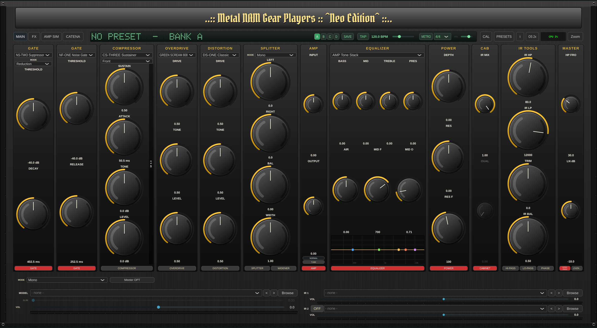
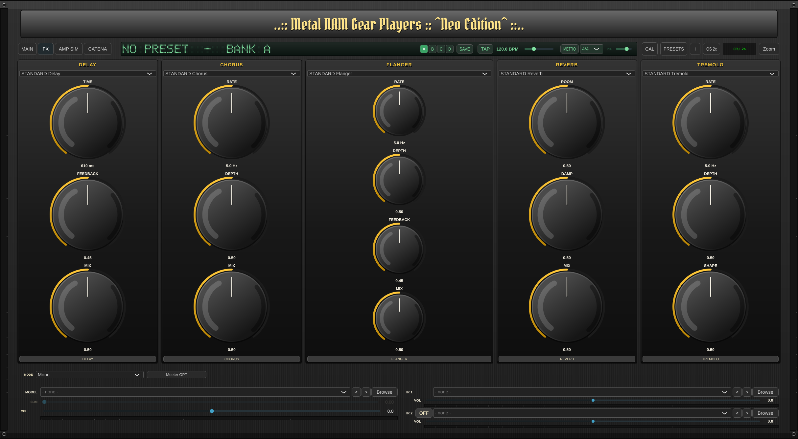

# Metal NAM Gear Players — Neo Edition for GNU/LINUX - Debian e derivate compatibili

[](https://wakatime.com/badge/github/fabionet/metal-nam-gear-player) [](https://wakatime.com/badge/user/018e231a-2b44-44e5-9016-e7803e9b68da/project/b9698415-e371-4069-8859-a465436d0826)

> ## ✅ Avviso di Sicurezza — risolto in v0.2.0 -- attensione per le versioni antecedenti relativo alla build per windows
>
> La vulnerabilità **UNC path bypass** (sul rischio di Leack di credenziali NetNTLM su sistema operativo Windows via SMB) segnalata per la v0.1.3 è **corretta anche nei binari** a partire dalla **v0.2.0**.
>
> `isLocalSafePath` in `PluginProcessor.cpp` ora rifiuta i percorsi UNC in entrambe le forme (`//server/share` e `\\server\share`), i percorsi device NT (`\\?\`, `\\.\`) e gli schemi di rete `smb:` `nfs:` `afp:` `ftp:` `http:` `https:` `cifs:` `dav:` `davs:` `file:`. Il controllo si applica al percorso del modello, dell'IR e del **secondo IR**.
>
> **Chi usa i binari v0.1.3 deve aggiornare.** Dettagli tecnici: [SECURITY.md](SECURITY.md)

A full-featured guitar amp-sim plugin (VST3 / LV2 / Standalone) built with [JUCE](https://juce.com), based on a fork of [mikeoliphant/neural-amp-modeler-lv2](https://github.com/mikeoliphant/neural-amp-modeler-lv2) and powered by the [NeuralAudio](https://github.com/mikeoliphant/NeuralAudio) engine for [Neural Amp Modeler](https://github.com/sdatkinson/neural-amp-modeler) model playback.

Gli host lo vedono come **"Metal NAM Gear Players Neo"**.

> **Convivenza con l'edizione Full.** Questa è la linea **Neo**, con identità propria: codice VST3 `NgpN`, URI LV2 `urn:fabionet:metalnamgearplayers-neo`, pacchetto Debian `metal-nam-gear-players-neo`. Non condivide nessun identificatore né alcun file con l'edizione **Full** (`metal-nam-gear-player`), quindi le due si installano e si caricano insieme nella stessa DAW.

> The original headless LV2 plugin lives on the [`custom-dual-stereo`](../../tree/custom-dual-stereo) branch. Active development happens on [`juce-rewrite`](../../tree/juce-rewrite) (default branch).

## Screenshots

**MAIN tab** — Noise Gate, Comp, Overdrive/Distortion, Splitter, Amp, 5-band EQ **con analizzatore di spettro e bande trascinabili**, Power, Cab, IR Tools **con IR BAL**, Master. In alto il **display LCD** con banchi, TAP e metronomo; in basso i **due caricatori IR** con volumi e meter separati.

> Nello scatto il modello caricato è un ENGL `amp_cab`, che contiene già la cassa: per questo la sezione **CAB** e il **primo caricatore IR** sono spenti e attenuati: è l'esclusione automatica, non un difetto. Il secondo caricatore resta attivo con la sua IR.



**FX tab** — Delay, Chorus, Flanger, Reverb, Tremolo (post-cab effects):



**AMP SIM (GEAR SX) tab** — sezione di voicing dell'amplificatore GEAR SX, tre canali:


**AMP SIM (MARCHELLOW) tab** — MARCHELLOW (JCM 800 2203, 1981) con selettore valvole EU/US e FX loop:


**CATENA tab** — mappa del percorso del segnale; il nodo **CAB 2** compare quando il secondo IR è attivo:


## Features

- **NAM model playback** — supports both V1 (WaveNet/LSTM) and A2 (SlimmableContainer) models, with a **Slim** slider for real-time quality scaling. The slider is enabled only on models that actually carry sub-models: on a V1 it is greyed out, because there is nothing to choose.
- **Two IR loaders** — each with its own volume and level meter, crossfaded by an **IR BAL** knob in the IR Tools section. The second one switches on automatically in Dual-Mono and Stereo, and can be enabled by hand in Mono.
- **Automatic cab bypass** — when the loaded model already contains the cabinet (`gear_type` `amp_cab` or `full-rig`), the first IR loader goes into true bypass and greys out, so you never stack two cabinets. The second stays available.
- **IR quality tools**: high-pass / low-pass filters, trim, phase invert
- **Full FX chain**:
  - Pre-model: Smart Gate, Overdrive, Distortion
  - Post-model: 5-band EQ + Depth + Resonance, Noise Gate, High-Pass, Loudness Normalization
  - Post-cab: Delay, Chorus, Flanger, Reverb, Tremolo
- **Gain-staging / calibration** (ported from the reference [NeuralAmpModelerPlugin](https://github.com/sdatkinson/NeuralAmpModelerPlugin)): Output Mode (Raw / Normalized / Calibrated) and Calibrate Input with dBu level — with automatic fallback when a model lacks calibration metadata
- **Preset system** — factory presets by genre (Clean / Rock / Metal / Extreme Metal) plus a neutral **Default**, user presets, **import** of `.prs` (single) and `.prstl` (list), **export** of the current preset and a **full library backup** that embeds the `.nam` and IR files it references. Only our own formats are accepted; anything else is rejected without being opened.
- **2x oversampling** (true `juce::dsp::Oversampling`, latency reported to the host)
- **EQ spectrum analyser** — real-time FFT with the EQ response curve drawn on top and one draggable handle per band; the MID band also takes frequency on the horizontal axis and Q on the mouse wheel. The curve is computed with the same filter coefficients as the audio path, so it cannot drift from what you hear.
- **LCD display** — preset name and bank on a lit dot-matrix panel that scrolls when the text does not fit, four banks A/B/C/D for variants of the same preset, blinking **TAP** tempo, and a cowbell **metronome** with its own volume and time signatures (4/4, 3/4, 2/4, 6/8, 5/4, 7/8)
- CPU meter, level meters, Info popup with credits
- **Reaper helpers** — bundled ReaScripts in `extras/reaper/` for one-click LV2/VST3 track insertion and `.nam` / IR autoload (see [Reaper quick-start helpers](#reaper-quick-start-helpers) below)

## Requirements

- Run your host at the sample rate the model was trained at (usually **48 kHz**)
- Linux is the primary target. A **Windows MinGW cross-build** lives on the [`windows-mingw`](../../tree/windows-mingw) branch — pinned to JUCE 7.0.12 (JUCE 8 does not build under MinGW) with a small `JuceFontCompat.h` shim so the sources stay in sync with the Linux tree; toolchain in `cmake/mingw-w64-x86_64.cmake` and a required post-clone patch in `patches/juce-mingw-crossbuild.patch`. Since v0.2.0 the Windows build also produces the **LV2** bundle.

## Building (Linux)

```bash
git clone --recurse-submodules https://github.com/fabionet/metal-nam-gear-player.git
cd metal-nam-gear-player
cmake -B build-juce -S . -DCMAKE_BUILD_TYPE=Release
cmake --build build-juce -j 2
```

> **Note:** `-DCMAKE_BUILD_TYPE=Release` is required — an empty build type produces an unoptimized binary that stutters under load.

Artefacts land in `build-juce/juce/NAMCustom_artefacts/Release/`:

| Format     | Path                                            |
|------------|-------------------------------------------------|
| Standalone | `Standalone/Metal NAM Gear Players Neo`         |
| VST3       | `VST3/Metal NAM Gear Players Neo.vst3`          |
| LV2        | `LV2/Metal NAM Gear Players Neo.lv2`            |

There is no install target. Either copy the bundles by hand:

```bash
rsync -a --delete "build-juce/juce/NAMCustom_artefacts/Release/VST3/Metal NAM Gear Players Neo.vst3/" \
                  "$HOME/.vst3/Metal NAM Gear Players Neo.vst3/"
rsync -a --delete "build-juce/juce/NAMCustom_artefacts/Release/LV2/Metal NAM Gear Players Neo.lv2/" \
                  "$HOME/.lv2/Metal NAM Gear Players Neo.lv2/"
```

…or build a Debian package that places all three where hosts look for them:

```bash
./packaging/linux/build-deb.sh 0.2.0
sudo dpkg -i dist/metal-nam-gear-players-neo_0.2.0_amd64.deb
```

The package installs the VST3 in `/usr/lib/vst3`, the LV2 in `/usr/lib/lv2`, the standalone in `/usr/lib/metal-nam-gear-players-neo` with a symlink in `/usr/bin`, plus a desktop entry, the licences and both Italian guides.

### Submodule note

`deps/NeuralAudio` points to [fabionet/NeuralAudio](https://github.com/fabionet/NeuralAudio) (branch `nam-custom-patches`), a lightly patched fork that exposes model-metadata flags (`HasLoudness` / `HasInputLevel` / `HasOutputLevel`) used by the calibration logic.

## Models

Get `.nam` models from [Tone3000](https://www.tone3000.com/). Both V1 and A2 architectures are supported. For amp-only models, load an impulse response in the built-in IR loader to model the cabinet.

## Reaper quick-start helpers

Three ReaScripts in `extras/reaper/` cover different Reaper builds and formats:

| Script                     | Format | Target                       | Behaviour                                              |
|----------------------------|--------|------------------------------|--------------------------------------------------------|
| `nam_insert.lua`           | LV2    | Reaper Linux                 | Insert a plugin track, load the LV2 build              |
| `nam_autoload_lv2.lua`     | LV2    | Reaper Linux                 | Same as above, plus prompts for a `.nam` model and IR  |
| `nam_autoload_vst3.lua`    | VST3   | Reaper Windows (or wine)     | Insert the VST3, prompt for `.nam` + optional IR       |

Run any of them via **Actions → Load ReaScript** or from the CLI, e.g. `reaper -nonewinst extras/reaper/nam_autoload_lv2.lua`. When Reaper doesn't accept the model path programmatically, the autoload helpers fall back to copying the file path(s) to the system clipboard.

## License

**AGPL-3.0-or-later.** This project combines the GPL-3.0 upstream (`mikeoliphant/neural-amp-modeler-lv2`) with the JUCE 8 framework (AGPLv3 or commercial JUCE licence). Per GPL-3 §13, the combined derivative work is distributed under AGPLv3. See `LICENSE` for the full text and `CREDITS.md` for the complete attribution list.

### Third-party components

- **JUCE 8** — Raw Material Software Limited (AGPLv3 or commercial JUCE licence). GUI, DSP, plugin format wrappers.
- **VST3 SDK 3.7.x** — Steinberg Media Technologies GmbH (dual GPLv3 / Steinberg VST3 proprietary licence, used here under the GPLv3 branch via JUCE).
- **LV2 SDK** — LV2 authors (ISC). Plugin format for the LV2 build.
- **NeuralAudio** — Mike Oliphant (MIT). NAM model runtime engine. This build uses the [fabionet/NeuralAudio](https://github.com/fabionet/NeuralAudio) fork on branch `nam-custom-patches`.
- **neural-amp-modeler-lv2** (upstream) — Mike Oliphant and [contributors](https://github.com/mikeoliphant/neural-amp-modeler-lv2/graphs/contributors) (GPL-3.0-or-later). The base plugin this project forks from.
- **Neural Amp Modeler / NeuralAmpModelerCore** — Steven Atkinson (MIT). NAM model format, reference implementation, and source of the bundled test model `demo_wavenet_a1.nam` (MIT).
- **FFTConvolver** — HiFi-LoFi (MIT). Two-stage FFT convolution used by the IR loader.
- **dr_wav** — David Reid (MIT / public domain choice). WAV file loading for the IR loader.
- **denormal** — [Dougal-s/Aether](https://github.com/Dougal-s/Aether) (GPL-3.0). Single-header FPU denormal-handling helper at `deps/denormal/architecture.hpp`.

### Embedded UI fonts (SIL Open Font License 1.1)

Three OpenType fonts are embedded in the plugin binary and used solely for the UI. Full license text bundled at `juce/fonts/LICENSE-fonts.txt`.

- **Metal Mania** — © 2012 Open Window (Dathan Boardman)
- **Nosifer** — © 2011 Typomondo
- **Pirata One** — © 2012 Rodrigo Fuenzalida, Nicolas Massi

## Trademarks

- **Neural Amp Modeler**® is a trademark of Steven Atkinson.
- **VST**® is a trademark of Steinberg Media Technologies GmbH.
- **JUCE**™ is a trademark of Raw Material Software Limited.

This project is an independent fork and is **not affiliated with, endorsed by, or sponsored by** Steven Atkinson, Mike Oliphant, Raw Material Software, or Steinberg.
