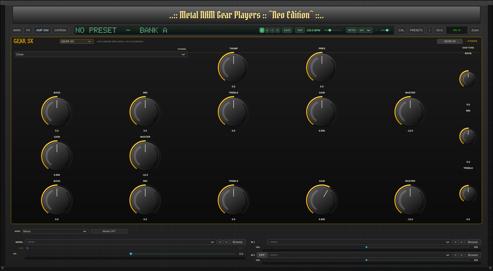
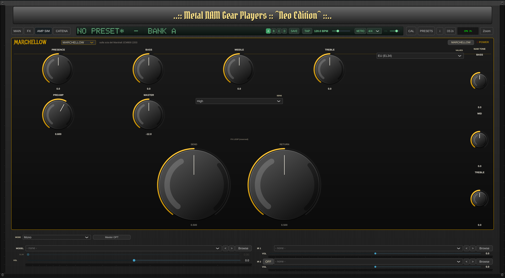
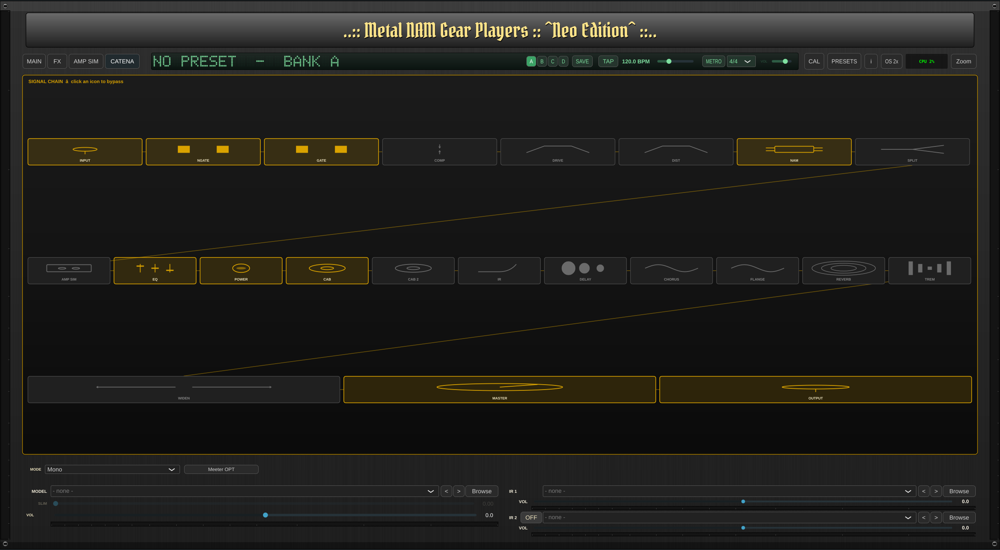

# METAL NAM GEAR PLAYER

> ## ⚠️ Avviso di Sicurezza — Vulnerabilità nei binari pre-compilati v0.1.3
>
> È stata identificata e corretta nel codice sorgente una **vulnerabilità di sicurezza critica** (UNC path bypass — furto credenziali NetNTLM su Windows via SMB):  
> la funzione `isLocalSafePath` in `PluginProcessor.cpp` non bloccava i percorsi UNC nella forma `//server/share`, consentendo a un progetto DAW malevolo di innescare una connessione SMB verso un server remoto e trasmettere l'hash NTLMv2 dell'utente.  
>
> **Il fix è presente nel codice sorgente** (branch `juce-rewrite`) ma **i binari pre-compilati della release v0.1.3 (Linux) e v0.1.3-windows contengono ancora la vulnerabilità non corretta.**  
> Si raccomanda di **compilare dal sorgente** (vedi sezione [Building](#building-linux)) oppure di attendere la prossima release che includerà il fix.  
>
> Dettagli tecnici: [SECURITY.md](SECURITY.md)

A full-featured guitar amp-sim plugin (VST3 / LV2 / Standalone) built with [JUCE](https://juce.com), based on a fork of [mikeoliphant/neural-amp-modeler-lv2](https://github.com/mikeoliphant/neural-amp-modeler-lv2) and powered by the [NeuralAudio](https://github.com/mikeoliphant/NeuralAudio) engine for [Neural Amp Modeler](https://github.com/sdatkinson/neural-amp-modeler) model playback.

The plugin is exposed to hosts as **"NAM Custom"**.

> The original headless LV2 plugin lives on the [`custom-dual-stereo`](../../tree/custom-dual-stereo) branch. Active development happens on [`juce-rewrite`](../../tree/juce-rewrite) (default branch).

## Screenshots

**MAIN tab** — Noise Gate, Overdrive/Distortion, Amp (NAM model), 5-band EQ, Power (Depth/Resonance), Cab (IR mix), IR Tools (HP/LP/Trim), Master (Loudness Normalization):


**AMP SIM (GEAR SX) tab** - Amplificator Simulation Voicing section (GEAR SX) -----



**AMP SIM (MARCHALLOW) tab** - Amplificator Simulation Voicing section (MARCHALLOW JCM 800 2203 1981) model EU/US tone -----



**FX tab** — Delay, Chorus, Flanger, Reverb, Tremolo (post-cab effects):


**CATENA tab** - Signal direction section -----




## Features

- **NAM model playback** — supports both V1 (WaveNet/LSTM) and A2 (SlimmableContainer) models, with a **Slim** slider for real-time quality scaling on A2 models
- **IR loader** with quality tools: high-pass / low-pass filters, trim, phase invert
- **Full FX chain**:
  - Pre-model: Smart Gate, Overdrive, Distortion
  - Post-model: 5-band EQ + Depth + Resonance, Noise Gate, High-Pass, Loudness Normalization
  - Post-cab: Delay, Chorus, Flanger, Reverb, Tremolo
- **Gain-staging / calibration** (ported from the reference [NeuralAmpModelerPlugin](https://github.com/sdatkinson/NeuralAmpModelerPlugin)): Output Mode (Raw / Normalized / Calibrated) and Calibrate Input with dBu level — with automatic fallback when a model lacks calibration metadata
- **Preset system** — factory presets by genre (Clean / Rock / Metal / Extreme Metal), user presets, direct link to [Tone3000](https://www.tone3000.com/) for more models
- **2x oversampling** (true `juce::dsp::Oversampling`, latency reported to the host)
- CPU meter, level meters, Info popup with credits
- **Reaper helpers** — bundled ReaScripts in `extras/reaper/` for one-click LV2/VST3 track insertion and `.nam` / IR autoload (see [Reaper quick-start helpers](#reaper-quick-start-helpers) below)

## Requirements

- Run your host at the sample rate the model was trained at (usually **48 kHz**)
- Linux is the primary target. A **Windows MinGW cross-build** lives on the [`windows-mingw`](../../tree/windows-mingw) branch — pinned to JUCE 7.0.12 (JUCE 8 does not build under MinGW) with a small `JuceFontCompat.h` shim so the sources stay in sync with the Linux tree; toolchain in `cmake/mingw-w64-x86_64.cmake` and a required post-clone patch in `patches/juce-vst3-helper-wine.patch`.

## Building (Linux)

```bash
git clone --recurse-submodules https://github.com/fabionet/metal-nam-gear-player.git
cd metal-nam-gear-player
cmake -B build-juce -S . -DCMAKE_BUILD_TYPE=Release
cmake --build build-juce -j 2
```

> **Note:** `-DCMAKE_BUILD_TYPE=Release` is required — an empty build type produces an unoptimized binary that stutters under load.

The VST3 bundle is produced at `build-juce/juce/NAMCustom_artefacts/Release/VST3/NAM Custom.vst3`. There is no install target; copy it to your user VST3 folder:

```bash
rsync -a --delete "build-juce/juce/NAMCustom_artefacts/Release/VST3/NAM Custom.vst3/" "$HOME/.vst3/NAM Custom.vst3/"
```

### Submodule note

`deps/NeuralAudio` points to [fabionet/NeuralAudio](https://github.com/fabionet/NeuralAudio) (branch `nam-custom-patches`), a lightly patched fork that exposes model-metadata flags (`HasLoudness` / `HasInputLevel` / `HasOutputLevel`) used by the calibration logic.

## Models

Get `.nam` models from [Tone3000](https://www.tone3000.com/). Both V1 and A2 architectures are supported. For amp-only models, load an impulse response in the built-in IR loader to model the cabinet.

## Reaper quick-start helpers

Three ReaScripts in `extras/reaper/` cover different Reaper builds and formats:

| Script                     | Format | Target                       | Behaviour                                              |
|----------------------------|--------|------------------------------|--------------------------------------------------------|
| `nam_insert.lua`           | LV2    | Reaper Linux                 | Insert an "NAM Custom" track, load the LV2 plugin      |
| `nam_autoload_lv2.lua`     | LV2    | Reaper Linux                 | Same as above, plus prompts for a `.nam` model and IR  |
| `nam_autoload_vst3.lua`    | VST3   | Reaper Windows (or wine)     | Insert the VST3, prompt for `.nam` + optional IR       |

Run any of them via **Actions → Load ReaScript** or from the CLI, e.g. `reaper -nonewinst extras/reaper/nam_autoload_lv2.lua`. When Reaper doesn't accept the model path programmatically, the autoload helpers fall back to copying the file path(s) to the system clipboard.

## License

**AGPL-3.0-or-later.** This project combines the GPL-3.0 upstream (`mikeoliphant/neural-amp-modeler-lv2`) with the JUCE 8 framework (AGPLv3 or commercial JUCE licence). Per GPL-3 §13, the combined derivative work is distributed under AGPLv3. See `LICENSE` for the full text and `CREDITS.md` for the complete attribution list.

### Third-party components

- **JUCE 8** — Raw Material Software Limited (AGPLv3 or commercial JUCE licence). GUI, DSP, plugin format wrappers.
- **VST3 SDK 3.7.x** — Steinberg Media Technologies GmbH (dual GPLv3 / Steinberg VST3 proprietary licence, used here under the GPLv3 branch via JUCE).
- **LV2 SDK** — LV2 authors (ISC). Plugin format for the LV2 build.
- **NeuralAudio** — Mike Oliphant (MIT). NAM model runtime engine. This build uses the [fabionet/NeuralAudio](https://github.com/fabionet/NeuralAudio) fork on branch `nam-custom-patches`.
- **neural-amp-modeler-lv2** (upstream) — Mike Oliphant and [contributors](https://github.com/mikeoliphant/neural-amp-modeler-lv2/graphs/contributors) (GPL-3.0-or-later). The base plugin this project forks from.
- **Neural Amp Modeler / NeuralAmpModelerCore** — Steven Atkinson (MIT). NAM model format, reference implementation, and source of the bundled test model `demo_wavenet_a1.nam` (MIT).
- **FFTConvolver** — HiFi-LoFi (MIT). Two-stage FFT convolution used by the IR loader.
- **dr_wav** — David Reid (MIT / public domain choice). WAV file loading for the IR loader.
- **denormal** — [Dougal-s/Aether](https://github.com/Dougal-s/Aether) (GPL-3.0). Single-header FPU denormal-handling helper at `deps/denormal/architecture.hpp`.

### Embedded UI fonts (SIL Open Font License 1.1)

Three OpenType fonts are embedded in the plugin binary and used solely for the UI. Full license text bundled at `juce/fonts/LICENSE-fonts.txt`.

- **Metal Mania** — © 2012 Open Window (Dathan Boardman)
- **Nosifer** — © 2011 Typomondo
- **Pirata One** — © 2012 Rodrigo Fuenzalida, Nicolas Massi

## Trademarks

- **Neural Amp Modeler**® is a trademark of Steven Atkinson.
- **VST**® is a trademark of Steinberg Media Technologies GmbH.
- **JUCE**™ is a trademark of Raw Material Software Limited.

This project is an independent fork and is **not affiliated with, endorsed by, or sponsored by** Steven Atkinson, Mike Oliphant, Raw Material Software, or Steinberg.
